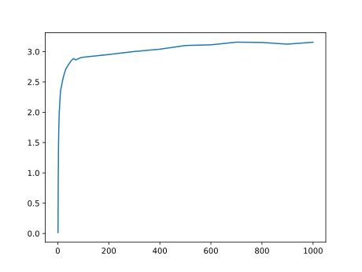

熟知 SPFA 算法在随机图上表现较优．考虑到实际分析极其复杂，我们通过蒙特卡洛模拟来验证这一结论．

首先给出 SPFA 算法的 C++ 实现：

??? info "SPFA 实现"

    ```cpp
    using Edge = pair<size_t, int64_t>;
    using Graph = vector<vector<Edge>>;

    size_t spfa_test(const Graph &graph, size_t source) {
      static constexpr int64_t INF = numeric_limits<int64_t>::max() >> 2;
      size_t V = graph.size();
      queue<size_t> q;
      vector<size_t> count(V, 0);
      vector<int64_t> dist(V, INF);
      vector<bool> in_queue(V, false);
      q.push(source), in_queue[source] = true, dist[source] = 0;

      size_t relaxations = 0;
      while (!q.empty()) {
        size_t u = q.front();
        q.pop(), in_queue[u] = false;
        for (const auto &[v, w] : graph[u]) {
          ++relaxations;
          if (dist[u] + w < dist[v]) {
            dist[v] = dist[u] + w;
            count[v] = count[u] + 1;
            if (count[v] >= V)
              return relaxations; // Negative cycle detected
            if (!in_queue[v])
              q.push(v), in_queue[v] = true;
          }
        }
      }

      return relaxations;
    }
    ```

## Trial 1

本次试验的生成图的算法如下：

??? info "随机图生成"

    ```cpp
    Graph random_graph(size_t V, size_t E, int64_t min_weight, int64_t max_weight) {
      Graph graph(V);
      static mt19937_64 rng(chrono::steady_clock::now().time_since_epoch().count());
      uniform_int_distribution<size_t> dist_node(0, V - 1);
      uniform_int_distribution<int64_t> dist_weight(min_weight, max_weight);
      for (size_t i = 0; i < E; ++i) {
        size_t u = dist_node(rng);
        size_t v = dist_node(rng);
        int64_t w = dist_weight(rng);
        graph[u].emplace_back(v, w);
      }
      return graph;
    }
    ```

固定 $V=1000$，设 $k=\frac{E}{V}$，并让 $k$ 从 $1$ 变化到 $1000$（有间隔），每个 $k$ 测试 $100$ 次取平均值，权重范围为 $[0,10^6]\cap\mathbb{Z}$．

结果如下，横轴为 $k$，纵轴为平均松弛次数与 $E$ 的比值：

<figure markdown="span">
    
</figure>

## Trial 2

在第二次试验中，随机生成图的算法不变，但权重范围改为 $[0,10^{12}]\cap\mathbb{Z}$．结果如下：

<figure markdown="span">
    
</figure>

发现图像与 Trial 1 的趋势相似．

## Trial 3

将权重范围改为 $[0, 100]\cap\mathbb{Z}$，结果如下：

<figure markdown="span">
    
</figure>

发现图像呈现先增后降的趋势，同时注意到最大值出现在 $k\approx 100$ 的位置．

## Trial 4

进一步尝试将权重范围改为 $[0,1000]\cap\mathbb{Z}$，并将 $k$ 的范围扩大到 $5000$，结果如下：

<figure markdown="span">
    
</figure>

发现图像的趋势与 Trial 3 类似，但最大值出现在 $k\approx 1000$ 的位置．

有理由相信，在 Trial 1 和 Trial 2 中，未出现先增后降的趋势是因为权重范围过大，导致拐点出现在 $k$ 的较大位置，试验的范围未覆盖到．
